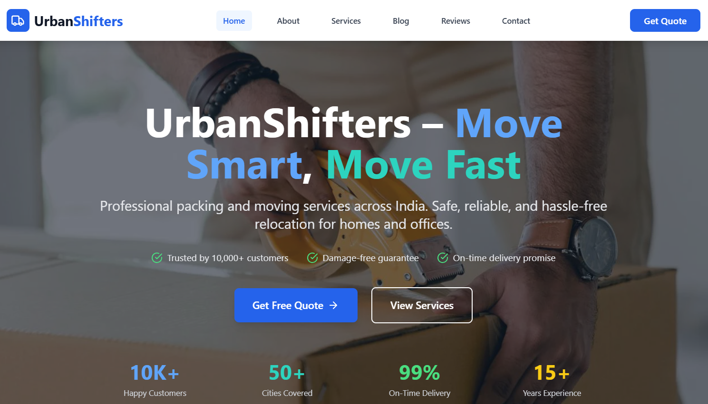

# UrbanShifters – Moving & Relocation Service Website
A full-stack web application for booking relocation and moving services. The platform allows users to browse services, request relocation quotes, and contact the team, while the backend manages inquiries, authentication, and service data.

## Live Demo
https://urban-shifters.vercel.app/

## Features
- Browse relocation and moving services  
- Request quotes and submit inquiries  
- Clean and responsive UI  
- Service data fetched dynamically  
- Secure backend with APIs and database  
- Admin-level data handling  

## Screenshot

## Technologies Used
### Frontend
- React.js  
- Vite  
- Tailwind CSS  
- JavaScript   
- Vercel Deployment  

### Backend
- Node.js  
- Express.js  
- MongoDB  
- Mongoose  
- JWT Authentication  
- REST API Architecture  

## Folder Structure
### frontend/
- assets/  
- src/  
  - components/  
  - data/  
  - layouts/  
  - pages/  
  - App.jsx  
  - index.css  
  - main.jsx  
- index.html  
- package.json  
- tailwind.config.js  
- vite.config.js  

### backend/
- assets/  
- config/  
- controllers/  
- middlewares/  
- models/  
- routes/  
- package.json  
- server.js  

## How to Use
1. Visit the website  
2. Explore the offered services  
3. Submit a request for a quote  
4. View service details and pricing  
5. Contact the team via the form  
6. Backend processes request data securely  

## What I Learned
- Full-stack project structure optimization  
- API creation and integration with React frontend  
- Form handling and backend validation  
- Responsive UI development using Tailwind CSS  
- Deploying frontend and backend separately  
- Clean folder organization for scalable projects  

## Author
**Shruti Rawat** 
Web Developer
